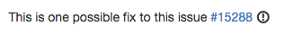

kfghlinker is a JS script to add better introspection to GH links.

Example from [Rails](https://github.com/rails/rails/pull/20080):

To install, use something like [TamperMonkey](https://chrome.google.com/webstore/detail/tampermonkey/dhdgffkkebhmkfjojejmpbldmpobfkfo?hl=en).
